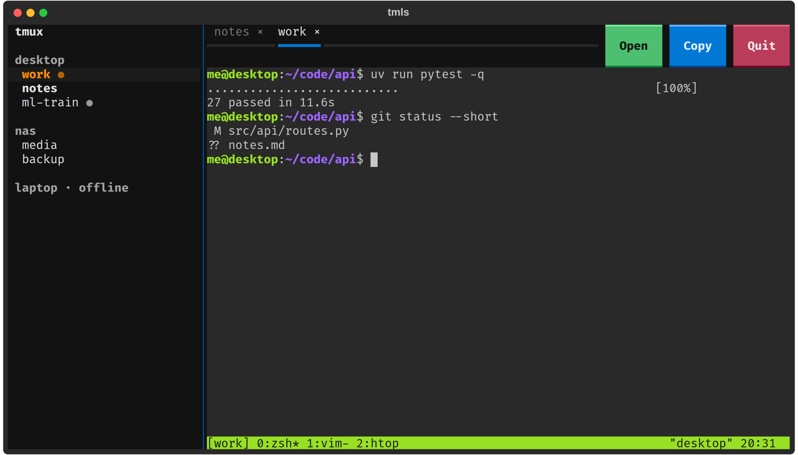

# tmls

tmux sessions from every machine in one terminal UI. Pick a session on the left and it
attaches in a tab on the right, or opens in a new terminal window, or you copy the attach
command.



## What it does

- **Lists sessions per host**: this machine (if it has tmux) plus any ssh hosts you name.
  The list refreshes every 5 seconds. A host that doesn't answer shows as *offline*.
- **Also lists Claude Code sessions on this machine that aren't in tmux**, under
  `<hostname> · kitty`, with the same status marks. There's no tmux to attach to, so a
  click focuses the [kitty](https://sw.kovidgoyal.net/kitty/) window they run in. This
  needs kitty remote control in `kitty.conf`:

  ```
  allow_remote_control socket-only
  listen_on unix:${XDG_RUNTIME_DIR}/kitty-{kitty_pid}
  ```
- **Shows what each session is doing**, with one mark after its name:

  | Mark | Meaning |
  |------|---------|
  | green `●` | running |
  | yellow `?` | Claude is waiting on you (a permission prompt or a question). Hover for which. It stays until you answer. |
  | orange `◆` | finished since you last looked: it needs you. Opening its tab clears it. |
  | red `✕` | Claude's last reply was an API error. Clears when the next turn starts. |
  | dim `○` | idle, and you've seen it |

  For a session running [Claude Code](https://docs.anthropic.com/en/docs/claude-code),
  tmls reads Claude's own status file (`~/.claude/sessions/<pid>.json`): busy, or a
  monitor or background shell still going, is running. Any other session counts as
  running while it has printed something in the last 30 seconds. Open tabs show the
  same mark in front of the name. A Claude session whose conversation has its own name
  (`/rename`, or one Claude made up) shows it on a dim second line, ending in how full its
  context is (`58%`; orange from 70%, red from 90%). Claude Code doesn't save its context
  limit, so tmls assumes 1M for Claude 5 models and 200k for older ones.
- **Attach in a tab**: click a session and it runs `tmux attach` (over `ssh -t` for
  remote hosts) in an embedded terminal. Every key goes to the session, including
  Ctrl+C and Tab. Open several and switch with the tab bar or **Alt+Shift+Left/Right**.
  **Alt+Shift+Up** moves to the session list: j/k or arrows move, Enter attaches, Esc goes
  back to the terminal.
  `×` on a tab detaches it; the session keeps running.
- **Mouse in the terminal**: the wheel scrolls back through tmux's history, and a drag
  selects and copies to your clipboard (needs `set -g mouse on` in tmux). Shift+drag
  still gives your terminal's own selection. Ctrl+drag selects and copies text on
  release; Ctrl+C copies the selection again, or interrupts when nothing is selected.
  Copied text loses trailing spaces on each line. Pasting
  (kitty's Ctrl+Shift+V, or right-click for the system clipboard) goes to the session, as a
  bracketed paste when it asks for one.
- **`ag`** (for agents): `ag ls` lists sessions on every host, `ag read NAME` prints the
  end of a session's screen, and `ag send NAME "text" [--from ME --mode MODE]` messages a
  Claude session by name (its own inbox socket, over ssh for remote hosts), a Codex thread by
  its `/rename` name (`codex queue`), or any other tmux session (paste + Enter).
  `HOST:NAME` picks the host. `--mode` states the sender's own permission mode; a Claude
  that skips permission prompts holds messages from senders that don't say they do too.
- **Links in the terminal**: Ctrl+click a URL to open it in your normal browser, or a
  `file:line` path to read that file beside the terminal. A URL printed by a remote host
  with `localhost` still opens on this laptop's `localhost`.
- **`ct`**: run instead of `claude` to start Claude inside a tmux session named after the
  folder (or rejoin it), so tmls can open it in a tab. Arguments go to `claude`; inside tmux
  it's plain `claude`.
- **New session**: `+` on a host line opens a small form (host, folder, name, start a
  shell or `claude`). The session is created with `tmux new-session` in that folder and
  opens in a tab. Optional named agent commands appear below `claude` in Start. Put them
  in `~/.config/tmls/agent-presets.json` as argv lists, for example
  `{"Opus plan": ["claude", "--model", "opus", "--permission-mode", "plan"]}`.
- **Ask**: sends a message to the shown session: type one, pick a saved prompt (one per
  line in `~/.config/tmls/prompts`; default "What's the progress?"), or resend one of the
  last ten you typed to its Claude. It goes in through tmux's paste buffer, then Enter.
- **🔔 Alerts**: every time a session turns `?`, `◆` or `✕`, tmls notes it. The bell
  shows how many are new; click it for the list (newest first) and click a line to jump to
  that session. Claude sessions sitting at a permission prompt are listed on top with the
  request and **Yes** / **No**, which send `1` or Esc. tmls checks that the same request is
  still on screen first. The panel has separate **Desktop**, **Sound**, and **Silence focused**
  switches, saved in `~/.config/tmls/notifications.json`. Desktop alerts use `notify-send`
  for `?` and `◆`; Sound uses `canberra-gtk-play` (off by default). Silence focused is on
  by default and skips alerts for the tab you are viewing.
- **Open** puts the same attach command in a new terminal window (`$TERMINAL`, else
  kitty, else `x-terminal-emulator`).
- **Copy** puts the attach command on the clipboard, for example
  `ssh -t nas "tmux attach -t work"`, so you can paste it anywhere.
- **Sketch** (optional) opens your [sketchpad](https://github.com/sagunkayastha/sketchpad)
  in the browser. See [Sketchpad button](#sketchpad-button).
- **Quit** (or Ctrl+Q) closes tmls and hangs up its tmux clients. Sessions keep running.

## Install

Needs Python 3.12+ and [uv](https://docs.astral.sh/uv/). tmux is needed on the machines
whose sessions you want to see, not necessarily on the one running tmls.

```sh
git clone https://github.com/sagunkayastha/tmls
cd tmls
uv tool install .
```

## Use

```sh
tmls                 # this machine plus the hosts in ~/.config/tmls/hosts
tmls nas laptop      # this machine plus these ssh hosts
```

The config file has one ssh host per line; blank lines and `#` comments are ignored:

```
# ~/.config/tmls/hosts
nas
laptop   # off most of the time
```

Hosts are whatever `ssh <host>` accepts, so put aliases and keys in `~/.ssh/config`.
Listing uses `ssh -o BatchMode=yes`, so a host that needs a password shows as offline.

## Sketchpad button

[sketchpad](https://github.com/sagunkayastha/sketchpad) is a drawing board that sends
sketches straight into a running Claude Code session. tmls can show a **Sketch** button
that opens it in your browser. The button only appears once you tell tmls where your
sketchpad hub is:

1. Set up the hub by following sketchpad's
   [quick start](https://github.com/sagunkayastha/sketchpad#quick-start-one-machine).
   It serves the board on port 8790.
2. Put the hub's URL on one line in `~/.config/tmls/sketchpad`:

   ```sh
   echo "http://192.168.1.10:8790" > ~/.config/tmls/sketchpad   # your hub's address
   ```

3. Restart tmls. The button opens that URL with `xdg-open`.

## How it works

`hosts.py` runs one shell script per host, locally or over ssh: the host's clock,
`tmux list-windows -a -F ...`, and the Claude Code status files of live processes. Times
are compared on each host's own clock. `term.py` is
the embedded terminal: a pty (`pty.fork`, so signals and resizes work) rendered through
[pyte](https://github.com/selectel/pyte) into a [Textual](https://textual.textualize.io/)
widget. `app.py` is the layout and the session/tab bookkeeping.

## Limitations

- Keyboard focus stays in the terminal once a tab is open; use the mouse for the list.
- Attaching resizes the tmux window to tmls's pane, which other attached clients see
  (that's tmux's `window-size` behaviour).
- Tested on Linux only.

## Development

```sh
uv run pytest        # 124 tests: parsing, status marks, key and mouse mapping, a real pty, and Textual pilot tests with fake hosts
```

## License

MIT, see [LICENSE](LICENSE).
